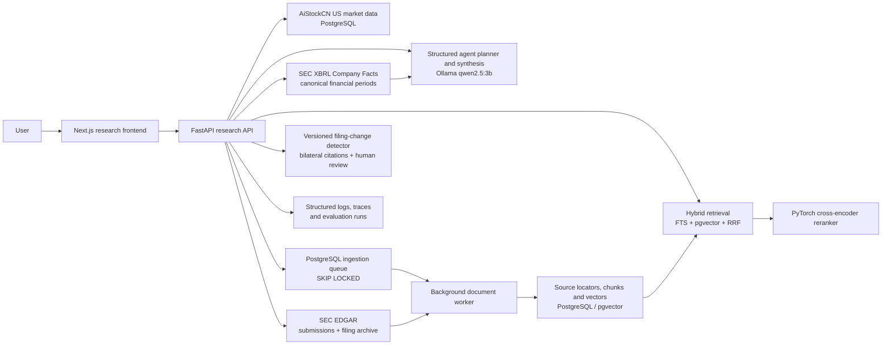

# AiStockCN — Financial Data & AI Research Platform

AiStockCN is a live financial-data platform for A-shares and United States equities, with an integrated, source-grounded US Equity Research Copilot. The established A-share workflow remains intact while the main product adds a separate US market workspace for company data, screening, model readiness and operations.

- Customer product: [aistockcn.com](https://aistockcn.com)
- Research Copilot: [aistockcn.com/research](https://aistockcn.com/research)
- Technical deep dive: [Research Copilot documentation](docs/RESEARCH_COPILOT.md)
- Documentation index: [docs/README.md](docs/README.md)

The Research Copilot is part of the authenticated AiStockCN product and shares its navigation and login session. Its API and background workers remain separate services so long-running document and analysis work cannot block the customer interface.

## Product overview

The Research Copilot is attached directly to AiStockCN's existing US equity database and operational platform. It gives users one research workflow for company filings, market data, deterministic calculations and source-grounded AI analysis.

## Product surfaces

| Surface | Purpose | Current runtime |
| --- | --- | --- |
| `aistockcn.com` | Customer-facing market, quantitative and research platform | Live |
| `aistockcn.com/us/overview` | US market data, screening and model-readiness workspace | Live, backed by an isolated read-only US API |
| `aistockcn.com/research` | US equity document research, filing-change detection, comparison and retrieval evaluation | Live within the authenticated product |

## United States market workspace

The main product exposes a dedicated `/us/*` route family without replacing or migrating the existing A-share pages:

- `/us/overview` — active universe, latest coverage, selection and product gates;
- `/us/data` — NASDAQ and NYSE company search with current daily observations;
- `/us/models` — the truthful readiness state for the independent `us_5d_v1` pipeline;
- `/us/picks` — existing rules-based US selection, explicitly separated from ML predictions;
- `/us/paper` — a disabled-by-default paper-trading surface that unlocks only after validation;
- `/us/system-monitor` and `/us/batch` — US ingestion coverage and recent job history.

The US workspace is served by a dedicated `us-market-api`. It reads the existing US company and market tables without changing the A-share control API or the independently deployed Web-Fei frontend.

## Research Copilot capabilities

- Search and select companies from the existing US equity universe.
- Sync the latest 10-K, 10-Q and 8-K filings directly from the official SEC EDGAR archive, with no paid data API key.
- Normalize SEC Company Facts into canonical revenue, profit, EPS, cash-flow and balance-sheet periods with taxonomy, accession and filing lineage.
- Calculate annual and quarterly changes, margins and free cash flow deterministically; numeric answers are rendered by the financial tool instead of being recalculated by the LLM.
- Upload annual reports and company filings as PDFs.
- Preserve SEC accession lineage, original URLs and honest source locators throughout ingestion and retrieval. PDFs use native page numbers; SEC HTML uses passage locators and is never presented as paginated.
- Ask company-specific questions in natural language with streamed progress events.
- Compare two or three companies through a structured multi-step agent workflow.
- Compare two indexed annual reports with reciprocal semantic matching; retain bilateral original-text citations, versioned run parameters, failures, reruns and human review history.
- Query market data and run deterministic return and volatility calculations through server-side tools.
- Combine PostgreSQL full-text search and `pgvector` similarity search using reciprocal-rank fusion.
- Rerank candidate passages with a PyTorch cross-encoder.
- Display document evidence separately from model inference and limitations.
- Run a retrieval benchmark that records Top-1 accuracy, MRR and lexical-baseline results.
- Operate without a paid OpenAI key by using a local Ollama model.

## Evidence contract

Citation metadata is never invented by the language model. The server attaches the source document ID, filename, page number and source URL from retrieved database records. The response schema keeps three concepts separate:

1. **Document evidence** — retrieved passages with verifiable source metadata.
2. **Model inference** — synthesis produced only from the supplied evidence and tool results.
3. **Limitations** — missing documents, incomplete coverage or other reasons to qualify the answer.

## Architecture



The operational product has a second isolated path: the main Next.js frontend calls `us-market-api` for `/us/*`, while all existing A-share routes continue to call the established panel API.

### Research request lifecycle

1. The authenticated frontend submits a company-scoped question.
2. The local LLM creates a JSON tool plan; the API removes tools outside the server allow-list.
3. The executor searches documents, queries company data and performs deterministic calculations as required.
4. Hybrid retrieval fuses lexical and vector candidates.
5. A PyTorch cross-encoder reranks the candidate passages.
6. The LLM synthesizes the supplied evidence and tool output.
7. The API returns a structured response containing evidence, inference, limitations and an execution trace.

## Implementation map

| Area | Implementation |
| --- | --- |
| FastAPI and streaming | `apps/api/app/research_main.py`, `apps/api/app/routers/research.py` |
| Multi-step agent and tool calling | `apps/api/app/services/research.py` |
| SEC discovery and filing sync | `apps/api/app/services/research_sec.py` |
| SEC XBRL normalization and calculations | `apps/api/app/services/research_financials.py` |
| Filing change runs, evidence and review | `apps/api/app/services/research_filing_changes.py` |
| PDF/HTML ingestion and background work | `apps/api/app/services/research_documents.py`, `apps/api/app/research_worker.py` |
| Hybrid RAG and pgvector | `apps/api/app/services/research_retrieval.py` |
| PyTorch reranking | `apps/api/app/services/research_models.py` |
| Retrieval evaluation | `apps/api/app/services/research_evaluation.py` |
| Next.js research UI | `apps/web/app/research/` |
| US market product UI | `apps/web/app/us/` |
| Isolated US market API | `apps/api/app/us_market_main.py`, `apps/api/app/services/us_market.py` |
| Model Registry and atomic activation | `apps/api/app/services/model_registry.py`, `scripts/create_model_registry.sql` |
| Immutable trained-model snapshots | `model_registry_artifacts.py`, `train_profile_runner.py` |
| Registry-resolved paper execution | `paper_trade_futu.py` |
| Docker environment | `docker-compose.yml`, `apps/api/Dockerfile.research` |
| Tests | `tests/test_research_service.py` and the wider `tests/` suite |

## Typical research workflow

1. Select a US-listed company.
2. Sync SEC filings and standardized financial facts, or upload a PDF, and wait for indexing to complete.
3. Ask about revenue, profitability, risks or changes in management commentary.
4. Compare two annual reports and inspect each proposed addition, deletion, strengthening, weakening or rewrite against both original passages.
5. Confirm, reject or flag each filing change for editing; reruns remain separate historical records.
6. Inspect the cited filename, exact page or HTML passage locator, and original source alongside the model inference.
7. Compare two or three companies using the same document, market-data and calculation tools.
8. Review retrieval quality through the evaluation page when maintaining or changing the search pipeline.

## Underlying AiStockCN platform

The original platform remains part of the same repository and provides the production context for the copilot:

- full-universe A-share and US market-data workflows;
- feature engineering and inference snapshots;
- LightGBM training, scoring and model profiles;
- expanding-window walk-forward backtesting;
- a PostgreSQL Model Registry that atomically controls the active model used by Models, Picks and Paper Trading;
- selection snapshots and operational monitoring;
- paper-trading reconciliation through an external gateway;
- FastAPI and Next.js control surfaces;
- long-running batch and reference-data orchestration.

## Stack

- **Frontend:** Next.js 15, React 19, TypeScript
- **Backend:** FastAPI, Uvicorn, Python 3.12
- **AI/RAG:** Ollama, sentence-transformers, PyTorch, PostgreSQL FTS, pgvector
- **Quant/ML:** Pandas, PyArrow, LightGBM, scikit-learn
- **Operations:** Docker Compose, structured logging, retry, rate limiting and background workers

## Repository layout

```text
apps/api/             FastAPI APIs, agent, retrieval and ingestion worker
apps/web/             Next.js customer and research interfaces
docs/                 Product, architecture, results and operating docs
run/                  Safe example configuration and model profiles
scripts/              SQL migrations and operational runners
tests/                Unit and integration-style service tests
*.py / *.sh           Data, model, backtest and trading workflows
```

## Local development

Local setup connects to existing platform services and does not seed market data. The Research Copilot expects:

- Docker and Docker Compose;
- a reachable PostgreSQL database with the existing AiStockCN schema and `pgvector`;
- a reachable Ollama service with `qwen2.5:3b`;
- local authentication values in `run/panel.env` and `run/panel_users.json`.

```bash
cp run/panel.env.example run/panel.env
cp run/panel_users.example.json run/panel_users.json

docker build -t aistockcn-research-api:20260813-filing-change-v1 -f apps/api/Dockerfile.research .
docker build -t aistockcn-panel-web:20260813-filing-change-v1 -f apps/web/Dockerfile .
docker compose up -d research-api research-worker panel-web
docker compose ps research-api research-worker panel-web
```

The current Compose file connects to the platform's existing external database and AI-service networks. See [the detailed local-development notes](docs/RESEARCH_COPILOT.md#local-development) before starting from a new machine.

### Validation

```bash
python3 -m pytest -q
docker compose config --quiet
npm --prefix apps/web run build
```

## Security and repository boundaries

Datasets, uploaded documents, logs, model caches, runtime state and real credentials are excluded from Git. Safe configuration examples are provided in `run/*.example`. Never use example credentials unchanged.

Web-Fei is an operationally protected frontend maintained in the separate private [aistockcn-web-fei](https://github.com/thisiscatcode/aistockcn-web-fei) repository. Its current production checkout remains in `apps/web-fei`; US product development does not modify or rebuild it, change its API contracts, or alter the tables it consumes.

## Documentation

- [Research Copilot](docs/RESEARCH_COPILOT.md)
- [Documentation index](docs/README.md)
- [User guide](docs/USER_GUIDE.md)
- [System design specification](docs/SYSTEM_DESIGN_SPEC.md)
- [System manual](docs/SYSTEM_MANUAL.md)
- [Production research results](docs/RESULTS.md)
- [A-share 10-day model profile](docs/A_SHARE_MEDIUM_10D_V2.md)
