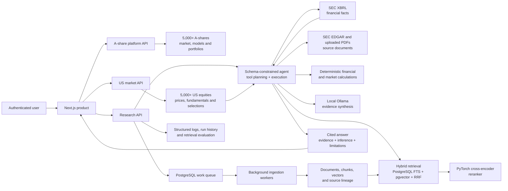

# AiStockCN — Source-Grounded AI Research for US and China Equities

AiStockCN brings market data, company filings, standardized financials and AI-assisted research into one authenticated product. It covers more than 5,000 actively tracked US-listed equities and more than 5,000 China A-shares, helping investors move from company discovery to evidence-backed analysis without switching between disconnected tools.

The integrated Research Copilot answers company questions, compares businesses and detects material filing changes while keeping original documents, financial facts, model inference and limitations clearly separated.

- Product: [aistockcn.com](https://aistockcn.com)
- Research Copilot: [aistockcn.com/research](https://aistockcn.com/research)
- Product and operating guide: [Research Copilot documentation](docs/RESEARCH_COPILOT.md)
- Documentation index: [docs/README.md](docs/README.md)

## Product at a glance

| Product capability | What it delivers |
| --- | --- |
| Market intelligence | Search and analyse 5,000+ US equities and 5,000+ China A-shares within one platform |
| Company research | Ask natural-language questions across market data, SEC filings and standardized financials |
| Verifiable answers | Open the original document, page or SEC HTML passage behind a claim |
| Financial analysis | Use normalized SEC XBRL facts and deterministic calculations for revenue, profit, margins and cash flow |
| Company comparison | Compare two or three businesses through the same evidence and calculation workflow |
| Filing change detection | Identify added, removed, strengthened or weakened disclosures with both versions shown side by side |

## Product interface

### Company research


One security-level workspace connects financial highlights, original filings, cited AI research, disclosure changes and peer comparison.

### Auditable filing changes


Annual-report comparisons retain both source documents, versioned run history and explicit human review.

### US market intelligence


The US workspace combines market coverage, selection status and research access without mixing administrative telemetry into the investor workflow.

## What users can do

### Research a company

Select a US-listed company and ask about revenue, profitability, margins, risks, guidance, management language or recent market performance. The agent chooses from approved financial-data, document-search and calculation tools, then returns one structured response.

### Verify every conclusion

Document claims retain their source identity throughout ingestion and retrieval. Native PDFs link to the original page. SEC HTML filings use honest passage locators and are never presented as paginated documents.

### Compare companies

Run a consistent two- or three-company comparison using standardized financial facts, market calculations and retrieved filing evidence instead of independent free-form summaries.

### Detect material filing changes

Compare two annual reports to surface additions, deletions, strengthened language, weakened language and rewrites. Every proposed change includes both original passages, reproducible run parameters, history and a human-review decision.

## Evidence contract

Citation metadata is not generated by the language model. The server attaches document identity, filename, locator, page number and source URL from stored source records.

| Response layer | Meaning |
| --- | --- |
| **Document evidence** | Retrieved filing passages with verifiable source metadata |
| **Financial and market evidence** | Database facts and deterministic calculations with an as-of date and source locator |
| **Model inference** | Interpretation produced only from the supplied evidence and approved tool output |
| **Limitations** | Data scope, as-of dates and other context required to interpret the response correctly |

Verified evidence remains available independently from model-generated interpretation.

## Product surfaces

### Customer workspace

| Surface | Purpose |
| --- | --- |
| `/overview` | China A-share portfolio and market workflow |
| `/us/overview` | US market coverage, screening and product status |
| `/us/data` | NASDAQ and NYSE company search and daily market observations |
| `/us/picks` | Rules-based US selection snapshots |
| `/us/paper` | USD paper-trading account and portfolio controls |
| `/research` | Company overview, cited Q&A, financials, filings, filing changes and comparison |

### Operations workspace

Administrative data is kept out of the customer research flow:

| Surface | Purpose |
| --- | --- |
| `/admin/research` | Filing coverage, ingestion state, failures and retrieval evaluation |
| `/us/models` | US model training and walk-forward governance |
| `/us/system-monitor` | US market-data pipeline health and run history |
| `/us/batch` | Scheduled US ingestion jobs |

All administrative routes enforce the administrator role on the server.

## Research agent

A research request is executed as a validated multi-step workflow:

1. The authenticated frontend submits a company-scoped question.
2. A local LLM produces a schema-constrained JSON tool plan.
3. FastAPI removes unknown tools and enforces the server-side allow-list.
4. The executor queries company data, standardized SEC facts, market history and document retrieval as required.
5. PostgreSQL full-text and `pgvector` candidates are fused with reciprocal-rank fusion.
6. A PyTorch cross-encoder reranks the retrieved passages.
7. Deterministic tools calculate financial changes, returns and volatility.
8. The local model synthesizes only the supplied evidence and tool output.
9. SSE lifecycle events and heartbeats keep the customer informed during long-running analysis.
10. The API returns evidence, inference, limitations and an execution trace as structured data.

The current planner and synthesizer run through local Ollama, so the product does not require a paid OpenAI API key.

## Architecture



The research API and document workers are separate from the customer frontend, so ingestion and long-running analysis do not block ordinary navigation. US market services are isolated from the established A-share execution path while remaining part of the same customer product.

## Filing ingestion and retrieval

- Discover and synchronize 10-K, 10-Q and 8-K filings from the official SEC EDGAR archive.
- Upload annual reports and company filings as PDFs.
- Preserve SEC CIK, accession number, filing date, source URL and native locator type.
- Normalize SEC Company Facts into canonical annual and quarterly financial periods.
- Extract page-aware PDF text and honest SEC HTML passages.
- Chunk and embed documents in background workers backed by a PostgreSQL queue using `SKIP LOCKED`.
- Fuse lexical and vector retrieval, then rerank candidates with a PyTorch cross-encoder.
- Evaluate retrieval with Top-1 accuracy, mean reciprocal rank and a lexical baseline.

## Reliability and safety

- Financial values and percentage changes are calculated by deterministic tools rather than recomputed by the LLM.
- Model plans and final output use validated structured schemas.
- Citation metadata is attached from database records after retrieval.
- Long-running responses emit SSE progress events and regular heartbeats.
- Bounded evidence context keeps inference efficient and predictable.
- Clear recovery actions support retryable requests.
- Verified evidence remains accessible independently from model synthesis.
- Ingestion runs, filing-change runs and human reviews retain durable history.
- Customer and administrative workflows use separate role-protected surfaces.

## Underlying financial platform

Research Copilot operates on the same live platform that supports:

- full-universe China A-share and US market-data workflows;
- feature engineering and inference snapshots;
- LightGBM training, scoring and model profiles;
- expanding-window walk-forward backtesting;
- atomic model activation through a PostgreSQL Model Registry;
- selection snapshots and operational monitoring;
- validation-gated paper-trading reconciliation;
- long-running market-data and reference-data orchestration.

## Implementation map

| Area | Implementation |
| --- | --- |
| FastAPI and SSE streaming | `apps/api/app/research_main.py`, `apps/api/app/routers/research.py` |
| Multi-step agent and tool execution | `apps/api/app/services/research.py` |
| SEC filing discovery and sync | `apps/api/app/services/research_sec.py` |
| SEC XBRL normalization and calculations | `apps/api/app/services/research_financials.py` |
| Filing change detection and review | `apps/api/app/services/research_filing_changes.py` |
| PDF/HTML ingestion and workers | `apps/api/app/services/research_documents.py`, `apps/api/app/research_worker.py` |
| Hybrid RAG and pgvector | `apps/api/app/services/research_retrieval.py` |
| PyTorch reranking | `apps/api/app/services/research_models.py` |
| Retrieval evaluation | `apps/api/app/services/research_evaluation.py` |
| Customer research UI | `apps/web/app/research/` |
| US market product UI | `apps/web/app/us/` |
| US market API | `apps/api/app/us_market_main.py`, `apps/api/app/services/us_market.py` |
| Model Registry | `apps/api/app/services/model_registry.py`, `scripts/create_model_registry.sql` |
| Container environment | `docker-compose.yml`, `apps/api/Dockerfile`, `apps/web/Dockerfile` |
| Tests | `tests/test_research_service.py` and the wider `tests/` suite |

## Technology

- **Frontend:** Next.js 15, React 19, TypeScript
- **Backend:** FastAPI, Uvicorn, Python 3.12
- **AI and RAG:** Ollama, sentence-transformers, PyTorch, PostgreSQL FTS, pgvector
- **Financial and ML:** Pandas, PyArrow, LightGBM, scikit-learn
- **Operations:** Docker Compose, structured logging, retries, rate limiting and background workers

## Repository layout

```text
apps/api/             FastAPI APIs, agent, retrieval and ingestion workers
apps/web/             Authenticated customer and research interfaces
docs/                 Product, architecture, results and operating documentation
run/                  Safe example configuration and model profiles
scripts/              SQL migrations and operational runners
tests/                Unit and integration-style service tests
*.py / *.sh           Data, model, backtest and trading workflows
```

## Local development

AiStockCN uses real platform services rather than seeded sample data. A local integration environment requires:

- Docker and Docker Compose;
- PostgreSQL with the AiStockCN schema and `pgvector`;
- an Ollama service with `qwen2.5:3b` on the configured AI-services network;
- authentication values in `run/panel.env` and `run/panel_users.json`.

```bash
cp run/panel.env.example run/panel.env
cp run/panel_users.example.json run/panel_users.json

docker compose build research-api panel-web
docker compose up -d research-api research-worker research-coverage-worker us-market-api panel-web
docker compose ps research-api research-worker research-coverage-worker us-market-api panel-web
```

The Compose environment connects to the platform's existing external database and AI-service networks. See [the detailed operating guide](docs/RESEARCH_COPILOT.md#local-development) before provisioning a new machine.

### Validation

```bash
docker compose config --quiet
docker compose run --rm --no-deps -v "$PWD/tests:/tests:ro" research-api \
  python -m unittest discover -s /tests -p 'test_research_service.py'
npm --prefix apps/web run build
```

## Security and responsible use

Datasets, uploaded documents, logs, model caches, runtime state and real credentials are excluded from Git. Safe configuration examples are provided in `run/*.example`; example credentials must never be used unchanged.

Research Copilot is an evidence-navigation and analysis system, not investment advice. Users should verify cited filings and financial data before making financial decisions.

## Documentation

- [Research Copilot](docs/RESEARCH_COPILOT.md)
- [Documentation index](docs/README.md)
- [User guide](docs/USER_GUIDE.md)
- [System design specification](docs/SYSTEM_DESIGN_SPEC.md)
- [System manual](docs/SYSTEM_MANUAL.md)
- [Quantitative model evaluation record](docs/RESULTS.md)
- [A-share 10-day model profile](docs/A_SHARE_MEDIUM_10D_V2.md)
