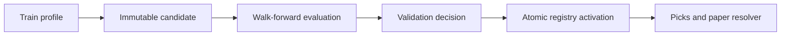

# A-Share Medium 10D V2 Profile

`medium_10d_v2` is a medium-horizon A-share ranking profile. This document defines the strategy and its governance boundary; the live PostgreSQL Model Registry remains authoritative for validation, activation and paper permission.

**Profile baseline:** 14 August 2026

## Strategy definition

| Parameter | Definition |
| --- | --- |
| Market | China A-shares |
| Universe | Current model candidate universe with ST exclusion |
| Horizon | 10 trading days |
| Target return | Next trading day's open to horizon close |
| Objective | LightGBM regression |
| Target transformation | Demeaned within each trade date |
| Published score | Cross-sectional percentile rank from 0 to 1 |
| Portfolio size | 20 names |
| Rebalance interval | 5 trading days |
| Turnover control | Replace at most 4 names; retain existing position sizes |
| Walk-forward minimum history | 504 trading days |
| Research capital | RMB 1,000,000 |

The profile is additive and does not rename the `short_1d` through `short_5d` profiles.

## Feature set

The current feature schema combines:

- open, high, low, close, volume and amount;
- turnover, amplitude and daily price change;
- total and float market capitalization and share counts;
- P/E, P/B, P/S and price-to-cash-flow values;
- industry category;
- 5- and 20-day trend, volatility, turnover and volume features;
- distance from recent highs and lows.

Training and inference use the same feature schema. Future-return fields exist only in training artifacts.

## Execution model

The realistic walk-forward method applies:

- T+1 open-proxy execution;
- conservative slippage and fee schedules;
- 100-share board lots;
- target-value sizing and a cash buffer;
- minimum liquidity and participation constraints;
- limit-up and limit-down skip rules;
- bounded constituent replacement.

Historical Stock Connect eligibility must be represented point in time before any workflow that depends on that execution constraint.

## Model lifecycle



`train_profile_runner.py` writes a versioned candidate with training metadata, inference scores, model files and a SHA-256 manifest. It does not change the active deployment.

The registry stores:

- market and model version;
- profile and artifact path;
- training dates and metrics;
- validation status;
- activation time, actor and revision;
- paper-enabled state;
- activation and rollback history.

## Current recorded evaluation

The latest saved realistic walk-forward artifact is `20260806T200252Z__medium_10d_v2`, covering 2025-05-23 to 2026-07-17. It reports a 0.05492 Rank IC, -14.52% net simulated total return and -26.31% maximum drawdown after the recorded execution costs and constraints.

See the [Quantitative Model Evaluation Record](RESULTS.md) for the complete metrics, assumptions and interpretation.

## Commands

Train and publish a new immutable candidate:

```bash
docker compose run --rm data-prep \
  python train_profile_runner.py --profiles medium_10d_v2
```

Run the realistic walk-forward evaluation:

```bash
docker compose run --rm data-prep \
  python backtest_profile_runner.py --profile medium_10d_v2
```

Never activate a model by editing `run/model_profiles.json` or copying files. Validation and activation must use the Model Registry workflow so Models, Picks and Paper resolve the same deployment revision.

## Research roadmap

Future profile versions should evaluate point-in-time profitability, balance-sheet quality, growth, dividends, events, corporate actions and Stock Connect eligibility. New features require leakage checks, documented availability dates and a new immutable model version.
