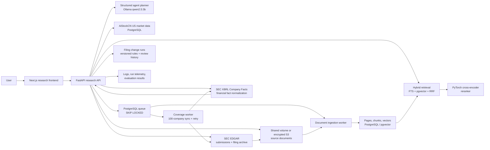

# AiStockCN Research Copilot

Production-oriented US equity research integrated with AiStockCN's existing market-data platform, authentication and navigation at `aistockcn.com/research`.

## Core company knowledge base

Research Copilot maintains a pre-indexed coverage set of 100 US-listed companies so a customer does not begin with an empty workspace. Company priority is deterministic:

1. Fei favourite stocks, ordered by their existing `display_num` preference.
2. Widely followed core companies.
3. The latest Cat/Lobster selection snapshots.
4. Twenty-session average dollar trading volume.

Only companies with an SEC CIK count toward the 100-company target, and share classes with the same CIK count as one issuer. US domestic filings (`10-K`, `10-Q`, `8-K`) and foreign-private-issuer filings (`20-F`, `40-F`, `6-K`) are supported. Both US-GAAP and IFRS Company Facts retain their original taxonomy, reporting currency and accession lineage. For each company, the coverage service targets two annual filings, one recent filing and SEC XBRL financial facts.

The `research-coverage-worker` owns the durable bootstrap queue, atomic job claiming, bounded retries and readiness reconciliation. Documents are indexed by the separate research workers. `GET /api/research/coverage` exposes company-level progress, errors and readiness to the administrator interface.

Operational state is deliberately separated from the customer research workflow. `/research` contains company analysis, documents, financials, filing changes and grounded Q&A. Coverage queues, indexing progress, failures and retrieval evaluation are restricted to administrators at `/admin/research`.

## US product interface

The US equity product uses a dedicated workstation shell and does not alter the A-share interface. Global US navigation lives in one persistent left rail; the top bar contains only the current page title and New York time. Company Research has one secondary navigation level for the selected security: Summary, Ask AI, Financials, Filings, Changes and Compare. This prevents product navigation and company tasks from appearing as two competing headers.

The interface uses a neutral cool-grey canvas, white analytical surfaces, navy navigation, blue primary actions and conventional green/red financial state colours. Tables, inputs and buttons share one compact scale across Research, Market Overview, Explorer, Picks, Paper and US administration. On narrow screens the left rail becomes a horizontally scrollable bottom navigation while the company task tabs remain independently scrollable.

## Deployment status

| Component | Status |
| --- | --- |
| Public Research Copilot | Live at `aistockcn.com/research` after authentication |
| Customer platform | Live at `aistockcn.com` through one product frontend |
| Current public runtime | Docker Compose on the existing AiStockCN host |
| Paid LLM API | Not required; the current agent uses local Ollama |

## What is live

- Company search over the existing US equity universe and market-history tables.
- Official SEC EDGAR discovery and sync for 10-K, 10-Q, 8-K, 20-F, 40-F and 6-K filings, using accession-number deduplication and declared fair-access identification.
- A durable 100-company coverage queue with Fei favourites first, bounded retries and visible company-level readiness.
- SEC Company Facts ingestion with canonical US-GAAP concept priorities, annual/quarterly/instant periods and original accession lineage.
- Deterministic revenue, profit, EPS, margin, cash-flow, free-cash-flow and balance-sheet calculations. The LLM does not recalculate these numeric facts.
- PDF upload with validation, SHA-256 deduplication and page-preserving extraction.
- Background ingestion worker using PostgreSQL `FOR UPDATE SKIP LOCKED`.
- BGE embeddings in `pgvector`, PostgreSQL full-text search, reciprocal-rank fusion and a PyTorch cross-encoder reranker.
- Natural-language answers that render document evidence separately from model inference and preserve server-owned source locators.
- A local Ollama `qwen2.5:3b` planner/synthesizer; no paid OpenAI key is required.
- Structured tool plans, server-side tool allow-listing, SSE progress events and multi-company comparison.
- A live reranker benchmark with persisted Top-1 accuracy, MRR and lexical-baseline results.
- Request IDs, structured latency logs, retries with exponential backoff, rate limiting and privacy-conscious run telemetry.
- Docker Compose services for the API, background worker and frontend.
- Versioned filing-change runs with reciprocal semantic matching, bilateral original-text evidence, durable failures, rerun lineage and append-only human review decisions.

## Architecture



The LLM never provides the citation metadata shown by the UI. The server attaches `document_id`, filename, locator and source URL from retrieval results. Uploaded PDFs retain native page numbers. SEC filing HTML has no reliable native pagination, so it is cited as `SEC filing HTML · passage N` and is never mislabeled as a PDF page. Model-generated interpretation is kept in a separate field and rendered in a separate card.

Numeric financial answers follow the same rule at a stricter boundary. The server selects canonical SEC Company Facts, calculates comparable-period changes and margins, and renders the factual answer from those typed values. Each fact retains taxonomy, concept, form, period, filing date and accession number. The local model may plan the `sec_financial_facts` tool and provide separately labelled qualitative interpretation, but it cannot overwrite the deterministic numeric answer.

## Filing Change Detection

Filing Change Detection compares two indexed annual reports for the same company. It is an auditable analysis workflow rather than a free-form request to summarize two documents:

1. The API validates that both immutable source records are indexed annual reports for the same symbol and that the older period precedes the newer period.
2. The worker performs reciprocal nearest-neighbour matching over the stored document vectors, so both deletions and additions can be surfaced.
3. Versioned deterministic rules classify added, deleted, strengthened, weakened and materially rewritten language, then rank candidates by semantic divergence, disclosure topic, wording intensity and changed numeric expressions.
4. Every candidate stores both source chunk IDs, both original excerpts, both filenames, both filing periods, and native PDF pages or honest SEC HTML passage locators.
5. Every run stores its algorithm version, thresholds, source-document hashes and embedding-model lineage. A rerun creates a new linked run; it never overwrites the prior result.
6. Failures remain visible with a stable error code and message. Interrupted work can be reclaimed safely by the PostgreSQL worker queue.
7. Results begin as `pending`. Confirm, reject and needs-edit decisions are appended to a review-history table while the latest decision is shown on the result.

The generated summary is deterministic and cannot alter the paired evidence. A human decision is therefore explicit rather than implied by fluent model output.

## Source-grounding contract

Every completed research response separates:

- `evidence`: retrieved document passages carrying server-owned document and locator metadata;
- `inference`: model synthesis generated from evidence and deterministic tool output;
- `limitations`: unavailable filings, missing coverage and other qualifications;
- `trace`: the allow-listed tools executed by the agent.

This prevents a fluent model answer from being presented as documentary evidence. Users can follow the original source link and inspect the cited PDF page or SEC HTML passage.

## Request path

1. The authenticated frontend sends a company-scoped question.
2. The local LLM returns a JSON tool plan. The API drops any tool not in the server allow-list.
3. The executor queries company/market data, runs deterministic return and volatility calculations, and conditionally runs document retrieval.
4. For financial questions, the executor loads normalized SEC XBRL facts and calculates annual or quarterly comparisons before synthesis.
5. Hybrid retrieval combines PostgreSQL English FTS and cosine search over BGE vectors using reciprocal-rank fusion when qualitative filing evidence is required.
6. `cross-encoder/ms-marco-MiniLM-L-6-v2` reranks the candidate passages with PyTorch.
7. The local LLM synthesizes only from the supplied context; numeric-only financial questions use deterministic synthesis.
8. The API emits SSE lifecycle events and a final structured response with evidence, inference, limitations and trace.

## Local development

The research API and worker are separately deployable services behind the integrated product frontend.

```bash
docker build -t aistockcn-research-api:20260813-filing-change-v1 -f apps/api/Dockerfile.research .
docker build -t aistockcn-panel-web:20260813-filing-change-v1 -f apps/web/Dockerfile .
docker compose up -d research-api research-worker panel-web
docker compose ps research-api research-worker panel-web
```

Required runtime values already used by the current installation are read from `run/panel.env`. Do not commit that file. Optional cloud document storage is enabled with `RESEARCH_S3_BUCKET`; local Compose uses the shared `research-uploads` volume when the variable is empty.

The Compose configuration intentionally joins the existing `paper-db` and `ai-services` networks because the copilot is integrated with the live platform database and local Ollama service. A new machine must provide equivalent PostgreSQL/pgvector and Ollama services rather than expecting seeded sample data.

## User workflow

1. Sign in to `aistockcn.com`, open Company Research and search by ticker or company name.
2. Selecting a company opens its Summary first: one compact security strip, an immediately usable AI question box, annual financials, latest filings and the most recent saved filing comparison.
3. Choose one task from the company navigation: Summary, Ask AI, Financials, Filings, Changes or Compare. Only the selected workspace is displayed; operational ingestion state is not mixed into the customer page.
4. In Ask AI, enter a focused company question or use a suggested task. The answer separates Document evidence, Model inference and Limitations. The execution trace is available under the collapsed “How this answer was produced” disclosure.
5. In Financials, inspect normalized SEC facts and their original taxonomy and filing lineage. In Filings, open or add source documents when required.
6. In Changes, compare two indexed annual reports. Each proposed change carries the older and newer source passage, saved algorithm version and review status; rerunning creates a linked historical result.
7. In Compare, analyse two or three companies using the same evidence and deterministic financial-data boundary.

Coverage queues, ingestion failures and retrieval evaluation belong to the administrator workflow at `/admin/research`; customers do not need to manage them before beginning research.

## Operational boundaries

- Docker Compose is the current public runtime.
- Real credentials, uploaded documents, logs, model caches and runtime state are excluded from Git.
- The example secret files define configuration shape only and must never be applied unchanged.
