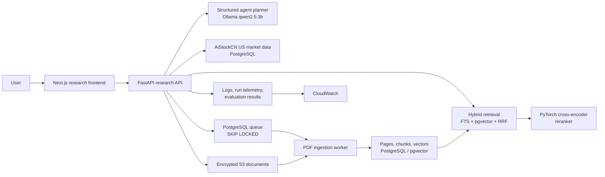

# AiStockCN Research Copilot

Production-oriented US equity research on top of AiStockCN's existing market-data platform. The customer site remains isolated at `aistockcn.com`; the copilot is deployed at `research.aistockcn.com`.

## Deployment status

| Component | Status |
| --- | --- |
| Public Research Copilot | Live at `research.aistockcn.com` |
| Customer platform | Live at `aistockcn.com` on an isolated frontend image |
| Current public runtime | Docker Compose on the existing AiStockCN host |
| Paid LLM API | Not required; the current agent uses local Ollama |
| Kubernetes | Manifests validated and deployment-ready; not the current public runtime |
| Terraform / AWS | Configuration validated but intentionally not applied because it creates chargeable resources |

## What is live

- Company search over the existing US equity universe and market-history tables.
- PDF upload with validation, SHA-256 deduplication and page-preserving extraction.
- Background ingestion worker using PostgreSQL `FOR UPDATE SKIP LOCKED`.
- BGE embeddings in `pgvector`, PostgreSQL full-text search, reciprocal-rank fusion and a PyTorch cross-encoder reranker.
- Natural-language answers that render document evidence separately from model inference and preserve filename/page citations.
- A local Ollama `qwen2.5:3b` planner/synthesizer; no paid OpenAI key is required.
- Structured tool plans, server-side tool allow-listing, SSE progress events and multi-company comparison.
- A live reranker benchmark with persisted Top-1 accuracy, MRR and lexical-baseline results.
- Request IDs, structured latency logs, retries with exponential backoff, rate limiting and privacy-conscious run telemetry.
- Docker Compose services for API, worker and frontend; Kubernetes rolling updates and probes; Terraform for EC2, S3, ECR and CloudWatch.

## Architecture



The LLM never provides the citation metadata shown by the UI. The server attaches `document_id`, filename, page number and source URL from retrieval results. Model-generated interpretation is kept in a separate field and rendered in a separate card.

## Source-grounding contract

Every completed research response separates:

- `evidence`: retrieved document passages carrying server-owned document and page metadata;
- `inference`: model synthesis generated from evidence and deterministic tool output;
- `limitations`: unavailable filings, missing coverage and other qualifications;
- `trace`: the allow-listed tools executed by the agent.

This prevents a fluent model answer from being presented as documentary evidence. Users can inspect the cited PDF page directly from the result.

## Request path

1. The authenticated frontend sends a company-scoped question.
2. The local LLM returns a JSON tool plan. The API drops any tool not in the server allow-list.
3. The executor queries company/market data, runs deterministic return and volatility calculations, and conditionally runs document retrieval.
4. Hybrid retrieval combines PostgreSQL English FTS and cosine search over BGE vectors using reciprocal-rank fusion.
5. `cross-encoder/ms-marco-MiniLM-L-6-v2` reranks the candidate passages with PyTorch.
6. The local LLM synthesizes only from the supplied context.
7. The API emits SSE lifecycle events and a final structured response with evidence, inference, limitations and trace.

## Local development

The research stack is deliberately separate from the customer frontend image.

```bash
docker build -t aistockcn-research-api:20260810-mvp -f apps/api/Dockerfile.research .
docker build -t aistockcn-research-web:20260810-mvp -f apps/web/Dockerfile .
docker compose up -d research-api research-worker panel-web-research
docker compose ps research-api research-worker panel-web-research
```

Required runtime values already used by the current installation are read from `run/panel.env`. Do not commit that file. Optional cloud document storage is enabled with `RESEARCH_S3_BUCKET`; local Compose uses the shared `research-uploads` volume when the variable is empty.

The Compose configuration intentionally joins the existing `paper-db` and `ai-services` networks because the copilot is integrated with the live platform database and local Ollama service. A new machine must provide equivalent PostgreSQL/pgvector and Ollama services rather than expecting seeded demonstration data.

## Kubernetes

Manifests are under `deploy/kubernetes`. They include two API replicas, two ingestion workers, two web replicas, a local Ollama deployment, readiness/liveness probes, rolling-update policies, ingress and resource boundaries.

```bash
kubectl apply -k deploy/kubernetes
kubectl -n aistockcn-research rollout status deployment/research-api
kubectl -n aistockcn-research rollout status deployment/research-worker
kubectl -n aistockcn-research rollout status deployment/research-web
```

Create `research-secrets` through the deployment secret manager; `secret.example.yaml` is a shape-only example and must not be applied unchanged. Replace image names with immutable ECR image digests for a real rollout.

## AWS / Terraform

`deploy/terraform` provisions an encrypted/versioned/private S3 document bucket, immutable scanned ECR repositories, a monitored EC2 k3s host, an encrypted gp3 volume, a least-privilege instance role, restricted SSH, and CloudWatch logs/metrics.

```bash
cd deploy/terraform
cp terraform.tfvars.example terraform.tfvars
terraform init
terraform plan
terraform apply
```

Terraform is not applied automatically because it creates chargeable AWS resources. The current public service runs on the existing AiStockCN host.

## User workflow

1. Open `research.aistockcn.com` and select a company from the AiStockCN US equity universe.
2. Upload an annual report or filing. The document moves through queued, extracting and search-ready states while preserving its page structure.
3. Ask a company-specific question. The API streams progress while the agent selects and executes its allow-listed document, market-data and calculation tools.
4. Review the answer's Document evidence, Model inference and Limitations sections. Each document passage includes its filename and page number.
5. Compare two or three companies. The system executes the required tools for each company before synthesizing the comparison.
6. Use the evaluation page to monitor Top-1 accuracy, MRR, lexical baseline and per-query ranks when the retrieval pipeline changes.

## Operational boundaries

- Docker Compose is the current public runtime.
- Kubernetes and Terraform are maintained as validated deployment assets, not described as the current runtime.
- Real credentials, uploaded documents, logs, model caches and runtime state are excluded from Git.
- The example secret files define configuration shape only and must never be applied unchanged.
