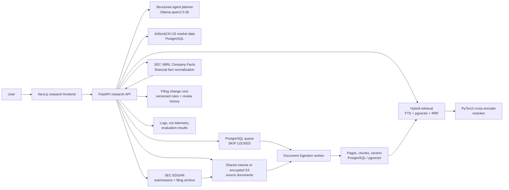

# AiStockCN Research Copilot

Production-oriented US equity research integrated with AiStockCN's existing market-data platform, authentication and navigation at `aistockcn.com/research`.

## Deployment status

| Component | Status |
| --- | --- |
| Public Research Copilot | Live at `aistockcn.com/research` after authentication |
| Customer platform | Live at `aistockcn.com` through one product frontend |
| Current public runtime | Docker Compose on the existing AiStockCN host |
| Paid LLM API | Not required; the current agent uses local Ollama |

## What is live

- Company search over the existing US equity universe and market-history tables.
- Official SEC EDGAR discovery and sync for the latest 10-K, 10-Q and 8-K, using accession-number deduplication and declared fair-access identification.
- SEC Company Facts ingestion with canonical US-GAAP concept priorities, annual/quarterly/instant periods and original accession lineage.
- Deterministic revenue, profit, EPS, margin, cash-flow, free-cash-flow and balance-sheet calculations. The LLM does not recalculate these numeric facts.
- PDF upload with validation, SHA-256 deduplication and page-preserving extraction.
- Background ingestion worker using PostgreSQL `FOR UPDATE SKIP LOCKED`.
- BGE embeddings in `pgvector`, PostgreSQL full-text search, reciprocal-rank fusion and a PyTorch cross-encoder reranker.
- Natural-language answers that render document evidence separately from model inference and preserve server-owned source locators.
- A local Ollama `qwen2.5:3b` planner/synthesizer; no paid OpenAI key is required.
- Structured tool plans, server-side tool allow-listing, SSE progress events and multi-company comparison.
- A live reranker benchmark with persisted Top-1 accuracy, MRR and lexical-baseline results.
- Request IDs, structured latency logs, retries with exponential backoff, rate limiting and privacy-conscious run telemetry.
- Docker Compose services for the API, background worker and frontend.
- Versioned filing-change runs with reciprocal semantic matching, bilateral original-text evidence, durable failures, rerun lineage and append-only human review decisions.

## Architecture



The LLM never provides the citation metadata shown by the UI. The server attaches `document_id`, filename, locator and source URL from retrieval results. Uploaded PDFs retain native page numbers. SEC filing HTML has no reliable native pagination, so it is cited as `SEC filing HTML · passage N` and is never mislabeled as a PDF page. Model-generated interpretation is kept in a separate field and rendered in a separate card.

Numeric financial answers follow the same rule at a stricter boundary. The server selects canonical SEC Company Facts, calculates comparable-period changes and margins, and renders the factual answer from those typed values. Each fact retains taxonomy, concept, form, period, filing date and accession number. The local model may plan the `sec_financial_facts` tool and provide separately labelled qualitative interpretation, but it cannot overwrite the deterministic numeric answer.

## Filing Change Detection

Filing Change Detection compares two indexed annual reports for the same company. It is an auditable analysis workflow rather than a free-form request to summarize two documents:

1. The API validates that both immutable source records are indexed annual reports for the same symbol and that the older period precedes the newer period.
2. The worker performs reciprocal nearest-neighbour matching over the stored document vectors, so both deletions and additions can be surfaced.
3. Versioned deterministic rules classify added, deleted, strengthened, weakened and materially rewritten language, then rank candidates by semantic divergence, disclosure topic, wording intensity and changed numeric expressions.
4. Every candidate stores both source chunk IDs, both original excerpts, both filenames, both filing periods, and native PDF pages or honest SEC HTML passage locators.
5. Every run stores its algorithm version, thresholds, source-document hashes and embedding-model lineage. A rerun creates a new linked run; it never overwrites the prior result.
6. Failures remain visible with a stable error code and message. Interrupted work can be reclaimed safely by the PostgreSQL worker queue.
7. Results begin as `pending`. Confirm, reject and needs-edit decisions are appended to a review-history table while the latest decision is shown on the result.

The generated summary is deterministic and cannot alter the paired evidence. A human decision is therefore explicit rather than implied by fluent model output.

## Source-grounding contract

Every completed research response separates:

- `evidence`: retrieved document passages carrying server-owned document and locator metadata;
- `inference`: model synthesis generated from evidence and deterministic tool output;
- `limitations`: unavailable filings, missing coverage and other qualifications;
- `trace`: the allow-listed tools executed by the agent.

This prevents a fluent model answer from being presented as documentary evidence. Users can follow the original source link and inspect the cited PDF page or SEC HTML passage.

## Request path

1. The authenticated frontend sends a company-scoped question.
2. The local LLM returns a JSON tool plan. The API drops any tool not in the server allow-list.
3. The executor queries company/market data, runs deterministic return and volatility calculations, and conditionally runs document retrieval.
4. For financial questions, the executor loads normalized SEC XBRL facts and calculates annual or quarterly comparisons before synthesis.
5. Hybrid retrieval combines PostgreSQL English FTS and cosine search over BGE vectors using reciprocal-rank fusion when qualitative filing evidence is required.
6. `cross-encoder/ms-marco-MiniLM-L-6-v2` reranks the candidate passages with PyTorch.
7. The local LLM synthesizes only from the supplied context; numeric-only financial questions use deterministic synthesis.
8. The API emits SSE lifecycle events and a final structured response with evidence, inference, limitations and trace.

## Local development

The research API and worker are separately deployable services behind the integrated product frontend.

```bash
docker build -t aistockcn-research-api:20260813-filing-change-v1 -f apps/api/Dockerfile.research .
docker build -t aistockcn-panel-web:20260813-filing-change-v1 -f apps/web/Dockerfile .
docker compose up -d research-api research-worker panel-web
docker compose ps research-api research-worker panel-web
```

Required runtime values already used by the current installation are read from `run/panel.env`. Do not commit that file. Optional cloud document storage is enabled with `RESEARCH_S3_BUCKET`; local Compose uses the shared `research-uploads` volume when the variable is empty.

The Compose configuration intentionally joins the existing `paper-db` and `ai-services` networks because the copilot is integrated with the live platform database and local Ollama service. A new machine must provide equivalent PostgreSQL/pgvector and Ollama services rather than expecting seeded sample data.

## User workflow

1. Sign in to `aistockcn.com`, open Research Copilot from the navigation and select a company from the US equity universe.
2. Sync the latest 10-K, 10-Q and 8-K from SEC EDGAR, sync standardized financial facts, or upload a PDF. Documents move through queued, extracting and search-ready states while preserving source lineage.
3. Ask a company-specific question. The API streams progress while the agent selects and executes its allow-listed document, market-data and calculation tools.
4. Review the answer's Document evidence, Model inference and Limitations sections. Each passage includes its filename and an honest native-page or SEC-HTML locator.
5. Select two indexed annual reports in Filing Change Detection. Each proposed change includes the older and newer source passage, the saved algorithm version and a pending review state.
6. Confirm, reject or flag changes for editing. Rerunning creates a new historical run linked to the earlier one.
7. Compare two or three companies. The system executes the required tools for each company before synthesizing the comparison.
8. Use the evaluation page to monitor Top-1 accuracy, MRR, lexical baseline and per-query ranks when the retrieval pipeline changes.

## Operational boundaries

- Docker Compose is the current public runtime.
- Real credentials, uploaded documents, logs, model caches and runtime state are excluded from Git.
- The example secret files define configuration shape only and must never be applied unchanged.
