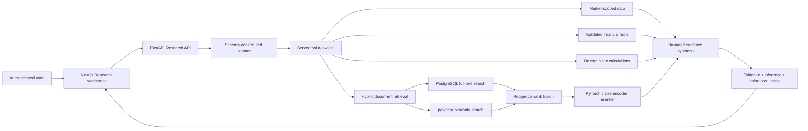
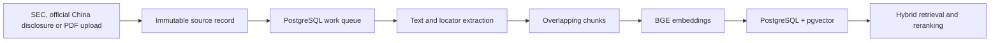

# AiStockCN Research Copilot

Research is AiStockCN's source-grounded company workspace for US stocks and China A-shares. It combines original filings, financial evidence, market data, deterministic calculations and multi-step agent execution at [US Research](https://aistockcn.com/us/research) and [A-share Research](https://aistockcn.com/cn/research).

**Audience:** product, financial research and AI engineering

**Documentation baseline:** 14 August 2026


## Product capabilities

- Search AiStockCN's production universe of 5,000+ actively tracked US equities and 5,000+ A-shares.
- Review company identity, price context, standardized financials and original filings in one workspace.
- Ask natural-language questions with citations to the underlying document or financial fact.
- Compare two or three companies through one consistent evidence and calculation process.
- Detect added, removed, strengthened, weakened or materially rewritten annual-report language.
- Preserve the boundary between evidence, deterministic output and model inference.
- Inspect how an answer was produced without exposing internal operational controls to ordinary users.

## Evidence contract

Citation metadata is server-owned. The language model cannot create or alter the document ID, filename, filing accession, page, passage locator or source URL displayed by the product.

| Response layer | Contract |
| --- | --- |
| `evidence` | Retrieved filing passages with stored source identity and locator metadata |
| `financial_evidence` | Validated facts and deterministic calculations with period, unit and source lineage |
| `inference` | Model interpretation generated only from approved tool output and bounded evidence |
| `limitations` | Data scope, as-of dates and interpretation constraints |
| `trace` | Approved tools executed by the research agent |

PDFs retain native page numbers. SEC HTML filings use `SEC filing HTML · passage N` because the source has no reliable native pagination.

## Customer workflow

1. Search by ticker or company name.
2. Open the company Summary for price context, annual financials, filings and filing-change history.
3. Select Ask AI, Financials, Filings, Changes or Compare.
4. Ask a focused question or choose a suggested research task.
5. Inspect the cited evidence separately from the model interpretation.
6. Open the original filing or fact lineage when a claim affects a decision.

Coverage orchestration, ingestion telemetry, failures and retrieval evaluation are administrator functions under `/admin/research`; they are not mixed into the customer research page.

## Research request architecture



The planner and synthesizer use Groq's OpenAI-compatible API with strict JSON schemas. The provider call has one end-to-end latency budget; rate limits and provider failures degrade to verified evidence rather than unsupported prose.

## LangGraph agent execution

1. The frontend submits a company-scoped request through an authenticated server route.
2. A typed LangGraph `plan` node creates a schema-constrained JSON plan.
3. FastAPI removes unknown tools and enforces the server-side allow-list.
4. The executor calls market, financial, calculation and retrieval tools as required.
5. Lexical and vector candidates are fused with reciprocal-rank fusion.
6. A market-specific PyTorch cross-encoder reranks candidate passages.
7. Financial changes, returns and volatility are calculated by deterministic code.
8. The model synthesizes a response from bounded evidence with server-assigned `D1`, `D2` citation identifiers.
9. A LangGraph validation node checks every identifier against returned evidence and records pass, warning, degraded or failed status.
10. Server-Sent Events report progress; graph nodes and tool calls record separate timings.
11. The API persists privacy-conscious trace metrics and returns the structured response.

## Filing ingestion

Research supports SEC discovery, official China disclosures and customer-supplied PDF documents.

### SEC filings

- Domestic issuer forms: `10-K`, `10-Q`, `8-K`.
- Foreign private issuer forms: `20-F`, `40-F`, `6-K`.
- Issuers are normalized through SEC CIK and accession lineage.
- SEC fair-access identification and request pacing are applied by the server.
- Company Facts support both US-GAAP and IFRS taxonomies while retaining the original concept and currency.

### China A-share disclosures

- The official CNINFO issuer map resolves exchange identity for SSE, SZSE and BSE companies.
- Annual, semiannual and quarterly reports retain announcement ID, exchange, report period and original PDF URL.
- PDF bytes are verified and deduplicated by SHA-256 before indexing.
- Chinese retrieval uses `BAAI/bge-small-zh-v1.5`, PostgreSQL `simple` FTS, `pg_trgm`, pgvector and `BAAI/bge-reranker-base`.
- Extracted financial values are not eligible for deterministic evidence until unit, period and statement checks pass.

### Document processing



Uploads are validated and deduplicated by SHA-256. Workers claim jobs atomically with PostgreSQL `FOR UPDATE SKIP LOCKED`, allowing interrupted work to be retried safely.

## Financial facts and calculations

SEC Company Facts are normalized into canonical annual, quarterly and instant periods. Every stored fact retains its taxonomy, concept, unit, period, form, filing date and accession number.

Deterministic tools calculate:

- revenue and net-income changes;
- EPS changes;
- operating and net margins;
- operating cash flow and free cash flow;
- selected balance-sheet comparisons;
- market returns and volatility.

The model may choose the tool and explain the result, but it does not recalculate or overwrite the numeric answer.

## Filing Change Detection

Filing Change Detection is an auditable comparison workflow rather than a free-form document summary:

1. Both sources must be immutable annual filings for the same issuer, ordered from older to newer.
2. Reciprocal semantic matching searches in both directions so additions and deletions are both discoverable.
3. Versioned rules classify changes and rank them by semantic divergence, topic, language intensity and changed numeric expressions.
4. Every candidate stores both chunk IDs, excerpts, filing periods and original locators.
5. Every run stores its algorithm version, thresholds, document hashes and embedding-model lineage.
6. A rerun creates a new linked record; prior results remain unchanged.
7. Confirm, reject and needs-edit decisions are appended to the review history.

The generated summary cannot modify the paired source evidence.

## Retrieval evaluation

The administrator evaluation page runs persisted benchmark questions through the same retrieval path used by Research Copilot. It records:

- Top-1 accuracy;
- mean reciprocal rank;
- result counts and latency;
- lexical-baseline performance;
- embedding and reranker model identity.

This makes retrieval changes measurable instead of relying on visual inspection of a few answers.

## Reliability and security

- Internal APIs accept only localhost and explicitly trusted service identities.
- Customer authentication and administrator authorization are enforced by the Next.js server.
- POST research requests use per-actor rate limiting.
- Responses carry request IDs and structured latency logs.
- SEC requests use bounded retries and exponential backoff.
- SSE heartbeats keep long-running requests observable through reverse proxies.
- Model context is bounded and response schemas are validated.
- Source evidence remains accessible independently from generated interpretation.
- Uploaded files, credentials, model caches, logs and runtime state are excluded from Git.

## Runtime services

| Service | Responsibility |
| --- | --- |
| `panel-web` | Authenticated product UI and server-side API gateway |
| `research-api` | Research requests, filings, facts, retrieval and evaluation endpoints |
| `research-worker` | Extraction, chunking, embeddings and filing-change work |
| `research-coverage-worker` | Issuer-level filing and financial-fact orchestration |
| PostgreSQL / pgvector | Metadata, facts, queues, chunks, vectors, runs and review history |
| Groq GPT-OSS | Remote structured planning and bounded evidence synthesis |
| LangGraph | Typed plan, execution and citation-validation state workflow |

## Local integration environment

The repository connects to real platform services rather than seeded sample data. Prepare ignored runtime configuration first:

```bash
cp run/panel.env.example run/panel.env
cp run/panel_users.example.json run/panel_users.json
```

Provide PostgreSQL with `pgvector`, the AiStockCN schema and a Groq API key in the ignored runtime configuration. Then build and start the product services:

```bash
docker compose build research-api panel-web
docker compose up -d \
  research-api research-worker research-coverage-worker \
  us-market-api panel-web
docker compose ps \
  research-api research-worker research-coverage-worker \
  us-market-api panel-web
```

Validate the configuration and focused research tests:

```bash
docker compose config --quiet
docker compose run --rm --no-deps -v "$PWD/tests:/tests:ro" research-api \
  python -m unittest discover -s /tests -p 'test_research_service.py'
npm --prefix apps/web run build
```

Local Compose uses the shared `research-uploads` volume. Optional object storage can be configured through `RESEARCH_S3_BUCKET`; secrets remain outside the repository.
