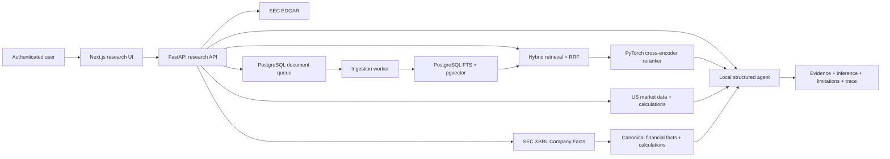
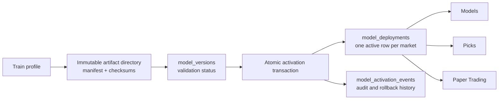

# System Design Spec

## Goal

Build an operator-friendly multi-market quant workflow that can ingest data, train market-specific models, produce ranked signals, run backtests, and coordinate paper trading through external gateways.

The A-share workflow is stable and remains the system of record for its existing routes and artifacts. United States equity functionality is additive rather than a refactor of this workflow.

## Additive US Market Architecture

- `apps/web/app/us` provides dedicated `/us/*` product pages.
- `app.us_market_main` runs as a separate, read-only `us-market-api` service.
- The service reads `us_stock_master`, `us_stock_daily_metrics`, US selection snapshots and job history.
- The existing panel API and A-share pages keep their current contracts.
- The US model is an independent `us_5d_v1` pipeline; it must never consume A-share training samples or execution rules.
- US paper trading remains disabled until historical coverage, corporate-action handling and walk-forward validation pass.

The initial US market-data gate requires at least 504 trading dates. Until that gate passes, the product may display company data and rules-based screening but must report the ML model as `insufficient_history` and paper trading as `gated`.

## Web-Fei Protection Boundary

Web-Fei is versioned in the separate private [aistockcn-web-fei](https://github.com/thisiscatcode/aistockcn-web-fei) repository and is outside the US product scope. The current production checkout remains at `apps/web-fei`; its container image, runtime configuration, API contracts and database semantics must remain unchanged. US deployments target only the dedicated US API/workers and the main `apps/web` frontend.

## Research Copilot Architecture

The Research Copilot is an isolated product service over the existing US equity data plane. Its ingestion API can discover and download official SEC 10-K, 10-Q and 8-K filings, while continuing to accept customer-supplied PDFs. A PostgreSQL queue is claimed atomically by the background worker. The worker extracts source-aware text, creates overlapping chunks, generates BGE embeddings and stores them in `pgvector`. A separate financial ingestion path normalizes SEC Company Facts into typed, source-linked periods used by deterministic calculation tools.

Citation metadata remains server-owned. PDFs retain native page numbers. SEC HTML records its CIK, accession number, primary document and original archive URL, and uses explicit HTML passage locators because the source does not have stable native pages.

Financial facts are keyed by symbol, taxonomy, concept, unit, period and accession. Concept priority resolves common US-GAAP alternatives without discarding the original concept. Annual and quarterly percentage changes, margins and free cash flow are calculated outside the model. Numeric-only questions bypass generative synthesis and return deterministic, accession-cited answers; qualitative model output remains a separate inference field.

## Main Components

- `download_data.py` and `batch_download_all_a.py`
  - universe refresh and raw parquet ingestion
- `feature_engineering.py`
  - training feature generation
- `build_inference_features.py`
  - inference-only feature generation
- `train_lightgbm.py`
  - model training, metadata export, and scoring
- `backtest_walk_forward.py`
  - walk-forward historical evaluation
- `paper_trade_futu.py` and `paper_trade_daemon.py`
  - paper-trading orchestration
- `apps/api/app/services/model_registry.py`
  - model version registration, validation, atomic activation, rollback and audit
- `apps/api`
  - operational API layer
- `apps/web`
  - dashboard and control surface

## Architecture

The system is organized around immutable parquet/model artifacts, deterministic workflow steps and a PostgreSQL control plane for model deployment state.

1. Step 1 refreshes the stock universe and raw market data.
2. Step 2 converts raw data into the training panel.
3. Step 3 builds the latest inference snapshot.
4. Step 4 trains each profile, writes scores and publishes an immutable candidate under `quant_data/model_registry/<market>/<model_version>`.
5. Step 5 runs backtests on historical windows.
6. An operator records validation results and atomically activates an eligible candidate in PostgreSQL.
7. Models, Picks and Paper Trading resolve the same active deployment row; Paper verifies the artifact checksums before each cycle.
8. Paper Trading consumes the resolved score snapshot and reconciles trading intent.

`run/model_profiles.json` is only a training-profile catalog. It does not contain active deployment state. `quant_data/models` is retained as a migration artifact but is no longer read or overwritten by activation.

## Model Registry

Each `model_versions` row records market, version, profile, artifact path, SHA-256 manifest, training dates, validation status and metrics. `model_deployments` contains exactly one active model per market plus the paper-enabled flag and monotonic revision. Activation updates the deployment and inserts its audit event in one database transaction; it never copies files.

The initial migration selected the artifact actually consumed by production—`medium_10d_v2`—instead of the stale `short_3d` catalog value. This preserved live behavior while removing the contradictory state.

## Deployment Model

- Docker Compose is the primary local and server deployment entry point.
- The panel API serves both inspection and workflow-control routes.
- API client IP checks should stay narrow: localhost plus explicitly trusted local services only.
- The web app reads the panel auth config from mounted runtime files.

## Security Model

- Public repos should include only example config files.
- Runtime secrets are expected to live in local `run/` files that are git-ignored.
- The panel uses signed cookies and an admin key for workflow control endpoints.
- Recent changes also redact the paper-trading agent key from generated control-panel log stubs.

## Operational Priorities

- clear artifact lineage
- restartable batch jobs
- inspectable logs and state files
- low-friction local deployment
- explicit workflow visibility for operators
