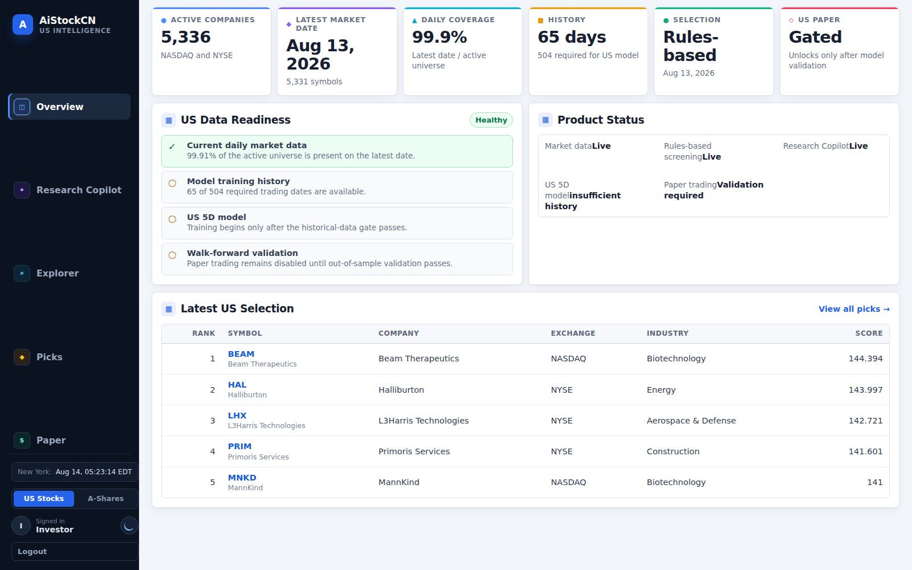
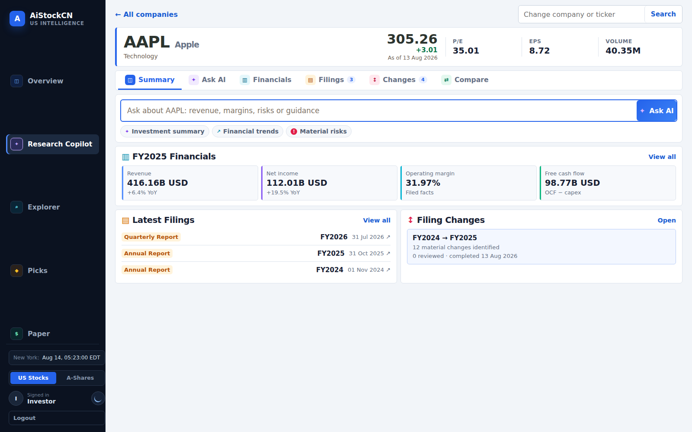

# AiStockCN User Guide

AiStockCN provides one authenticated workspace for China A-share workflows, US market intelligence and source-grounded company research.

**Audience:** investors, analysts and product users

**Product:** [aistockcn.com](https://aistockcn.com)

## Sign in and choose a market

After sign-in, AiStockCN opens the A-share Overview. Use the market switcher to move between:

- **A-Shares** — portfolio, market data, ranked signals and paper workflow in RMB and Shanghai time.
- **US Stocks** — US market data, company research, rules-based selections and the USD paper workspace in New York time.

Market currencies, model artifacts and execution rules remain separate. Switching the interface never combines the two portfolios.

## US Intelligence navigation

The US workspace uses one persistent navigation rail:

| Page | Use it for |
| --- | --- |
| **Overview** | Market coverage, product status and latest US selection |
| **Research Copilot** | Company financials, filings, cited Q&A, changes and comparison |
| **Explorer** | Search NASDAQ and NYSE companies and inspect daily observations |
| **Picks** | Review the latest rules-based Cat and Lobster selections |
| **Paper** | Review the USD simulation account and its activation status |

Administrators additionally see System, Data Jobs, Models and Admin. These operational tools are intentionally absent from investor accounts.

## Research a company

Open **Research Copilot**, then search by ticker or company name. Selecting a company opens its Summary.

The security header shows the latest available price context, P/E, EPS and volume. Company research is organized into six tasks:

| Task | Purpose |
| --- | --- |
| **Summary** | Financial highlights, recent filings and the latest saved filing comparison |
| **Ask AI** | Ask a focused question and inspect its evidence and reasoning boundary |
| **Financials** | Review normalized SEC financial facts, periods, units and filing lineage |
| **Filings** | Open original filings and manage source documents |
| **Changes** | Compare annual filings and review material disclosure changes |
| **Compare** | Analyse two or three companies through the same evidence workflow |

## Ask a source-grounded question

Good questions are specific about the subject and period, for example:

- How did revenue, operating margin and free cash flow change in the latest fiscal year?
- What risks did management strengthen or add between the last two annual reports?
- What evidence supports the current margin trend?
- Compare the latest revenue growth and risk disclosures of AAPL, MSFT and NVDA.

While the request runs, the page shows the current research stage. A completed answer is separated into:

- **Document evidence** — filing passages with original source links and locators;
- **Financial and market evidence** — typed facts and deterministic calculations with as-of dates;
- **Model inference** — interpretation based on the supplied evidence;
- **Limitations** — scope and timing context needed to read the answer correctly;
- **How this answer was produced** — the approved tools executed by the agent.

For PDFs, citations use the original page number. SEC HTML has no stable native pagination, so it uses an explicit passage locator.

## Review filing changes

Open **Changes**, choose the older and newer annual filings, then run change detection.

The workflow identifies candidate additions, deletions, strengthened language, weakened language and material rewrites. Each result preserves both original excerpts and both source locators.

Review decisions are explicit:

- **Confirm** — the candidate represents a material disclosure change;
- **Reject** — the candidate should not be treated as a material change;
- **Needs edit** — the paired evidence is useful but the classification or wording needs revision.

Rerunning a comparison creates a linked historical run instead of overwriting the earlier record.

## Compare companies

Open **Compare** from a selected company, add one or two peers, then enter a common research question. Use comparable periods and units when interpreting financial values. The result uses the same document, financial and calculation boundaries for every company.

## A-share workspace

The established A-share interface provides:

- **Overview** — portfolio summary, current positions, AI picks and planned orders;
- **Explorer** — inspect and export saved datasets;
- **Picks** — ranked signals from the selected profile and active deployment;
- **Paper** — account state, target holdings, positions, orders and reconciliation history.

Administrator-only pages expose pipeline control, model validation, activation history and system monitoring.

## Reading financial information responsibly

- Check the as-of date before comparing prices or market metrics.
- Open cited filings before relying on a qualitative claim.
- Treat model inference as analysis, not documentary fact.
- Do not interpret research rankings or paper results as a promise of future returns.
- Use original filings and regulated professional advice when making financial decisions.
